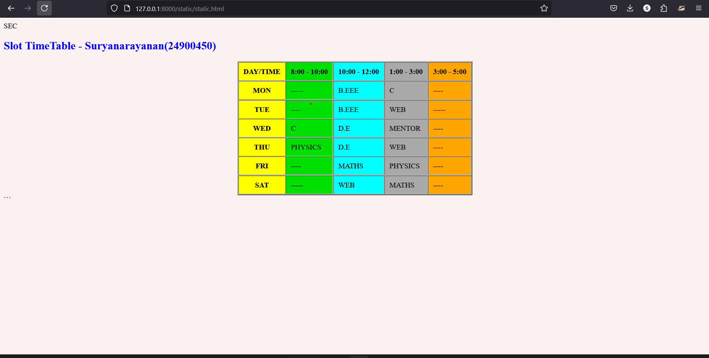

# Ex03 Time Table
## Date:16-11-2024.

## AIM
To write a html webpage page to display your slot timetable.

## ALGORITHM
### STEP 1
Create a Django-admin Interface.

### STEP 2
Create a static folder and inert HTML code.

### STEP 3
Create a simple table using ```<table>``` tag in html.

### STEP 4
Add header row using ```<th>``` tag.

### STEP 5
Add your timetable using ```<td>``` tag.

### STEP 6
Execute the program using runserver command.

## PROGRAM
```
<!DOCTYPE html>
<html lang="en">
<head>
    <meta charset="UTF-8">
    <meta name="viewport" content="width=device-width, initial-scale=1.0">
    <title>TimeTable</title>
</head>
<body align="center" style="background-color:rgba(247, 224, 224, 0.419);">
    <header></header> 
    <h2 style="color:blue;">Slot TimeTable - Suryanarayanan(24900450)</h2>   
    <table border="2" cellpadding="10"cellspacing="1" align="center" bgcolor="darkgrey" >
        <tr>
            <th bgcolor="yellow">DAY/TIME</th>
            <th bgcolor="powderyellow">8:00 - 10:00</th>
            <th  bgcolor="cyan">10:00 - 12:00</th>
            <th>1:00 - 3:00</th>
            <th bgcolor="orange">3:00 - 5:00</th>
            
        </tr>
        <tr>
            <th bgcolor="yellow">MON</th>
            <td bgcolor="powderyellow">-----</td>
            <td  bgcolor="cyan">B.EEE</td>
            <td>C</td>
            <td bgcolor="orange">----</td>
        </tr>
        <tr>
            <th bgcolor="yellow">TUE</th>
            <td bgcolor="powderyellow">----</td>
            <td  bgcolor="cyan">B.EEE</td>
            <td>WEB</td>
            <td bgcolor="orange">-----</td>
        </tr>
        <tr>
            <th bgcolor="yellow">WED</th>
            <td bgcolor="powderyellow">C</td>
            <td  bgcolor="cyan">D.E</td>
            <td>MENTOR</td>
            <td bgcolor="orange">----</td>
        </tr>
        <tr>
            <th bgcolor="yellow">THU</th>
            <td bgcolor="powderyellow">PHYSICS</td>
            <td  bgcolor="cyan">D.E</td>
            <td>WEB</td>
            <td bgcolor="orange">----</td>
        </tr>
        <tr>
            <th bgcolor="yellow">FRI</th>
            <td bgcolor="powderyellow">----</td>
            <td  bgcolor="cyan">MATHS</td>
            <td>PHYSICS</td>
            <td bgcolor="orange">----</td>
        </tr>
        <tr>
            <th bgcolor="yellow">SAT</th>
            <td bgcolor="powderyellow">-----</td>
            <td  bgcolor="cyan">WEB</td>
            <td>MATHS</td>
            <td  bgcolor="orange">----</td>
        </tr>
    </table>

    </body>
    
```


## OUTPUT


## RESULT
The program for creating slot timetable using basic HTML tags is executed successfully.
